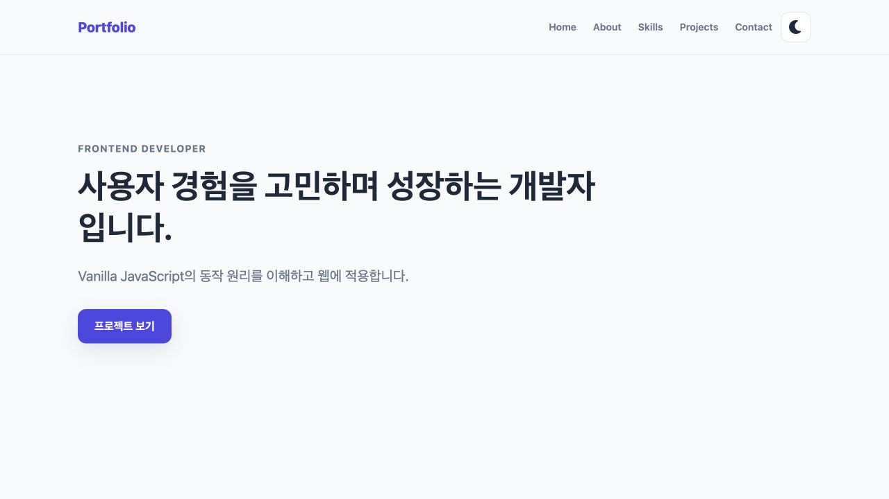
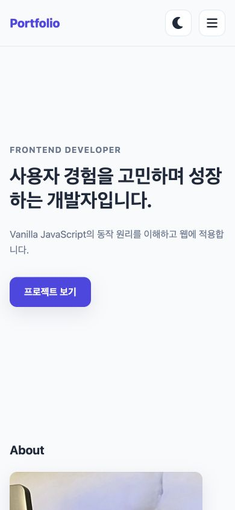
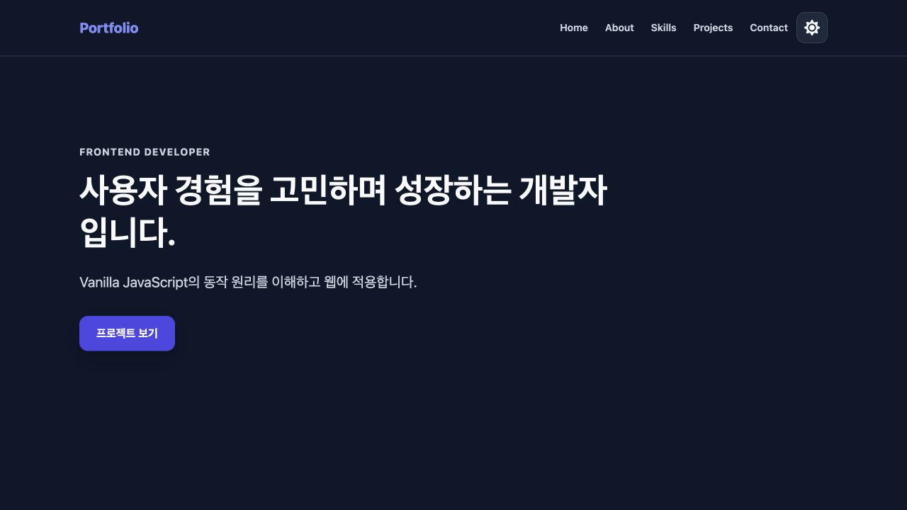

# Vanilla JavaScript Portfolio

HTML, CSS, Vanilla JavaScript의 기본 동작을 학습하기 위해 만든 반응형 포트폴리오입니다. 화면을 완성하는 것보다 사용자 이벤트가 상태를 바꾸고, 그 상태가 DOM과 화면에 반영되는 흐름을 코드로 분리하는 데 집중했습니다.

- 배포 URL: [https://heejeong13.github.io/codyssesy_b4_1/](https://heejeong13.github.io/codyssesy_b4_1/)
- 저장소: [https://github.com/heejeong13/codyssesy_b4_1](https://github.com/heejeong13/codyssesy_b4_1)

## 주요 기능

- 모바일 햄버거 메뉴와 접근성 상태(`aria-expanded`) 동기화
- Navigation 앵커의 부드러운 스크롤
- 60px 이상 스크롤 시 Header 스타일 변경
- 300px 이상 스크롤 시 Scroll-to-Top 버튼 표시
- Light/Dark 테마 전환과 `localStorage` 저장
- 사용자 선택이 없을 때 `prefers-color-scheme` 기반 시스템 테마 감지
- Intersection Observer를 이용한 Section 등장 애니메이션
- GitHub REST API의 loading, success, empty, error 상태 렌더링과 Retry
- GitHub Repository의 언어별 필터링
- Hero 문장의 타이핑 효과
- Contact Form의 입력 중 검증과 Formspree 실제 전송
- 키보드, Screen Reader, `prefers-reduced-motion` 접근성 보완

## 기술 스택

- HTML5 Semantic Markup
- CSS3 Variables, Flexbox, Grid, Media Query
- Vanilla JavaScript ES6+
- GitHub REST API
- Formspree
- Font Awesome
- GitHub Pages

외부 JavaScript/CSS 프레임워크는 사용하지 않았습니다.

## 프로젝트 구조

```text
.
├── index.html
├── css/
│   └── style.css
├── js/
│   └── main.js
├── images/
│   ├── profile.jpg
│   ├── screenshot-desktop.jpg
│   ├── screenshot-mobile.jpg
│   └── screenshot-dark.jpg
└── README.md
```

## Event → State → Render

기능마다 이벤트 처리와 DOM 변경을 분리해 다음 흐름이 드러나도록 구성했습니다.

```text
사용자 이벤트
→ JavaScript 상태 변경
→ render 함수 호출
→ class, attribute, text 또는 HTML 변경
→ CSS와 브라우저가 화면 갱신
```

대표적인 흐름은 다음과 같습니다.

| 기능 | Event | State | DOM / Render |
| --- | --- | --- | --- |
| 햄버거 메뉴 | Menu 버튼 `click` | `isMenuOpen` | `.active`, `aria-expanded`, Icon 변경 |
| 다크 모드 | Theme 버튼 `click` | `currentTheme` | `data-theme`, 버튼 Label과 Icon 변경 |
| 폼 검증 | `input`, `submit` | `formState` | 필드 오류, `aria-invalid`, 제출 상태 변경 |
| 프로젝트 필터 | Filter 버튼 `click` | `selectedLanguage` | `filter()` 결과로 버튼과 카드 재렌더링 |

## GitHub API 처리

`fetchProjects()`가 GitHub API를 호출하고 요청 결과를 `projectsState`에 저장합니다. `renderProjects()`는 네트워크 요청을 직접 수행하지 않고 현재 상태만 읽어 Projects DOM을 갱신합니다.

```text
fetch 요청
→ loading
→ response.ok 확인과 JSON parsing
→ success 또는 empty
→ 오류 발생 시 error
→ renderProjects()
```

- `loading`: 요청 중 안내 문구 표시
- `success`: `map()`과 Template Literal로 Repository Card 생성
- `empty`: 표시할 Repository가 없다는 문구 표시
- `error`: 오류 문구와 Retry 버튼 표시
- Retry: 같은 `fetchProjects()`를 다시 호출해 상태 흐름 재사용

인증하지 않은 GitHub API는 시간당 요청 횟수가 제한될 수 있습니다. 403을 포함한 HTTP 실패 응답은 `response.ok` 검사에서 오류 상태로 전환됩니다. Frontend 코드에는 GitHub Token을 저장하지 않습니다.

## 프로젝트 필터링

API를 다시 호출하지 않고 이미 받은 Repository 배열을 언어 기준으로 필터링합니다.

```text
Filter click
→ selectedLanguage 변경
→ repositories.filter()
→ renderProjects()
→ Filter 버튼과 Card DOM 변경
```

언어 정보가 없는 Repository는 `기타`로 표시합니다.

## 다크 모드와 시스템 테마

Theme 버튼을 누르면 `light`와 `dark` 상태를 전환하고 `<html>`의 `data-theme`을 변경합니다. CSS는 `[data-theme="dark"]`에서 변수 값을 교체하므로 Component별 색상을 다시 지정하지 않아도 전체 화면이 바뀝니다.

초기 테마의 우선순위는 다음과 같습니다.

```text
localStorage에 사용자가 선택한 테마가 있음
→ 저장된 테마 사용

저장된 선택이 없음
→ prefers-color-scheme 결과 사용
```

## Contact Form

Name, Email, Message를 필수 입력으로 검증합니다. `input` 이벤트에서는 해당 필드의 오류를 바로 갱신하고, `submit` 이벤트에서는 `event.preventDefault()`로 페이지 이동을 막은 뒤 전체 필드를 검증합니다.

검증을 통과하면 `FormData`를 Formspree로 전송하며 다음 상태를 화면에 표현합니다.

```text
idle → validationError → submitting → success / submissionError
```

전송 중에는 버튼을 비활성화하고, 실패하면 입력값을 유지해 다시 시도할 수 있게 합니다.

## 반응형 기준과 스크롤 설정

- Mobile First 기본 스타일: 768px 미만
- Tablet: 768px 이상
- Desktop: 1024px 이상
- Header 스타일 변경: `scrollY >= 60px`
- Scroll-to-Top 버튼: `scrollY >= 300px`
- Intersection Observer threshold: `0.2`
- Projects Grid: `repeat(auto-fit, minmax(...))`

`prefers-reduced-motion: reduce` 환경에서는 CSS Animation과 JavaScript Smooth Scroll을 줄이고 Hero 문장을 즉시 표시합니다.

## 실행 방법

Repository를 내려받은 뒤 VS Code Live Server로 `index.html`을 실행합니다. 별도의 Package 설치나 Build 과정은 없습니다.

## 스크린샷

### Desktop



### Mobile



### Dark mode



## 배포

GitHub Pages의 Publishing source는 `main` Branch의 `/(root)`입니다. HTML, CSS, JavaScript가 Build 없이 실행되는 정적 프로젝트이므로 Repository Root를 그대로 배포합니다.
